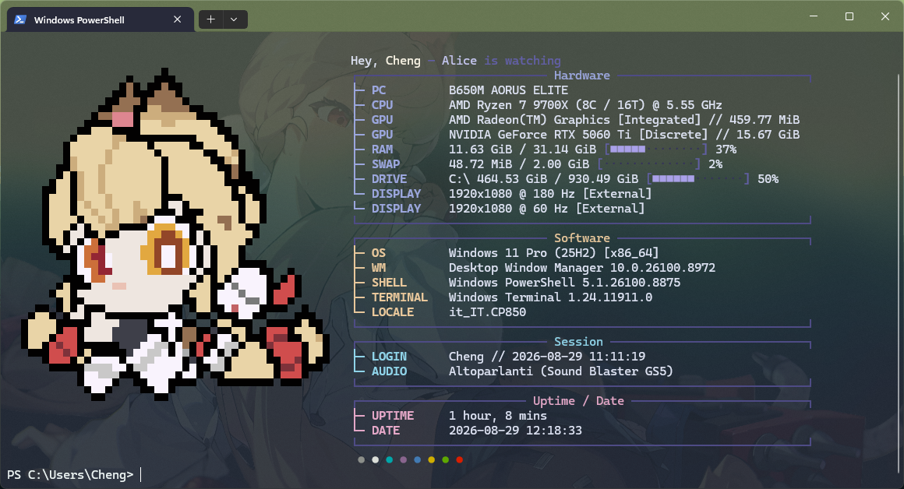

# Alice Terminal

A pixel-art splash screen for Windows Terminal, with a one-word command to turn
the whole thing off and get your plain terminal back.



> ### Written by AI
>
> Every file in this repository — the scripts, the configuration, this README —
> was written by Claude (Anthropic's AI) across one long conversation, with me
> steering it and testing the results. The pixel art started as an automated
> conversion of official artwork and was then touched up by hand.
>
> It works on my machine and every piece was tested as it was built, but treat
> it like any script you find on the internet: have a look at what it does
> before you run it. The code is commented specifically so that reading it is
> not a chore.

---

## What it does

Three separate things, each of which you can keep or drop:

1. **A splash screen when you open a terminal** — system specs next to a
   pixel-art character, drawn by [fastfetch](https://github.com/fastfetch-cli/fastfetch).
2. **A themed Windows Terminal** — colour scheme, background image, transparency.
3. **One switch for both** — `customize off` puts everything back to stock.

The character is Alice Thymefield from *Zenless Zone Zero*, but nothing here is
tied to her. Swapping in your own artwork is a couple of commands, described
further down.

---

## Requirements

- **Windows 10 or 11.** Nothing else to install by hand — the installer offers
  to fetch fastfetch for you.
- **Windows Terminal.** It ships with Windows 11. On Windows 10 you can get it
  from the Microsoft Store. Without it, the splash screen still works; only the
  theming step is skipped.
- **Permission to run scripts.** Windows blocks PowerShell scripts by default.
  Paste this once, and answer `Y`:

  ```powershell
  Set-ExecutionPolicy -Scope CurrentUser -ExecutionPolicy RemoteSigned
  ```

  This affects your user account only, not the whole machine, and it does not
  require administrator rights. It allows scripts stored locally on your PC to
  run, while still blocking unsigned ones downloaded from the internet. To see
  what it is set to right now: `Get-ExecutionPolicy -List`.

  Worth knowing: this is a guard against running something by accident, not a
  security wall. Anyone can bypass it with a command-line flag, and real malware
  always does, so allowing local scripts does not meaningfully widen your
  exposure. What it does not protect you from is you deciding to run something
  you should not have — including this. Read the scripts first.

- **Python** is optional. You only need it if you want to redraw the artwork.
  Everything else works without it.

No extra fonts to install: the splash uses characters that are already in the
font Windows Terminal comes with.

---

## Install

1. **Download this repository.** If you have git, this is the smoother route:

   ```powershell
   git clone https://github.com/Cheng98989/alice-thymefield-terminal.git
   ```

   Otherwise click the green *Code* button above and choose *Download ZIP*, then
   unzip it wherever you like.

   The folder can live anywhere. Documents, Desktop, a second drive — it does
   not matter, nothing is hardcoded.

2. **Open PowerShell in that folder.** In File Explorer, right-click inside the
   folder and pick *Open in Terminal*.

3. **If you downloaded the ZIP, unblock the files:**

   ```powershell
   Get-ChildItem -Recurse | Unblock-File
   ```

   Windows tags everything that comes out of a downloaded archive as "from the
   internet", and refuses to run scripts marked that way even after you have
   allowed local scripts. Skip this and step 4 fails with *"is not digitally
   signed"*. `git clone` does not leave that tag, which is why cloning avoids
   the whole thing.

4. **Run the installer:**

   ```powershell
   .\install.ps1
   ```

   It walks through six steps and tells you what it is doing at each one. If
   fastfetch is missing it asks before installing it. Nothing needs
   administrator rights.

5. **Open a new terminal window.** The splash appears.

If you want to try it without letting it touch your Windows Terminal settings,
run `.\install.ps1 -NoAppearance`. To install it but keep the splash off until
you ask for it, use `.\install.ps1 -NoAutostart`.

Running the installer again is harmless — it checks what is already done and
skips it. Rerun it after moving the folder somewhere else.

---

## Turning it on and off

```
customize            show what is currently on
customize on         turn everything on
customize off        back to a plain Windows terminal
customize toggle     flip between the two
customize save       remember your current look as the "on" state
```

`customize off` stops the splash screen and removes the colour scheme,
background image and transparency from your terminal profile. Your terminal
looks exactly like a fresh Windows install. `customize on` brings it all back.

The look changes instantly. The splash screen applies from the next window you
open.

To control just the splash and leave the theming alone, there is a separate
switch for it:

```
fastfetch auto            show whether it is on
fastfetch auto -y         turn it on    (also: on, yes, 1)
fastfetch auto -n         turn it off   (also: off, no, 0)
fastfetch auto toggle     flip it

fastfetch icon            show which picture is in use
fastfetch icon <name>     switch to a character in characters/
fastfetch icon <file>     import a picture (.png to convert, or a ready .txt)
```

Anything else you type after `fastfetch` goes straight to the real program, so
`fastfetch --version`, `fastfetch -s cpu` and the rest keep working normally.

---

## Making it your own

### Change the artwork

Every character lives in its own folder under `fastfetch/characters/`, holding
the picture and the logo generated from it:

```
fastfetch/characters/
├─ alice/
│  ├─ alice.png      the picture
│  └─ alice.txt      generated from it, this is what the terminal draws
└─ yourcharacter/
   └─ ...
```

Switching between them is instant, and nothing overwrites anything:

```powershell
fastfetch icon alice
```

To bring in a new one, point the command at any picture. It gets a folder of its
own, is converted, and becomes the current logo:

```powershell
fastfetch icon C:\path	o\yourcharacter.png
```

Run `fastfetch icon` on its own to see which character is in use and what else
is available. A folder you drop in by hand shows up there too — selecting it
converts the picture the first time.

The command also writes the new width and height into `config.jsonc`. Those
numbers tell fastfetch where to start the text column, so leaving them stale
would overlap the art or leave a gap in the middle of the screen. Letting the
command handle it removes the step that is easiest to forget.

### Drawing your own

Open a character's `.png` in any pixel-art editor (Aseprite, Piskel, even Paint
if you zoom in), draw over it, save, then feed it back:

```powershell
fastfetch icon fastfetch\characterslicelice.png
```

Any size works — but **keep the height an even number**. Each character on
screen holds two pixels stacked vertically, so an odd height leaves half a row
over. The converter handles it by adding a blank row, but it is tidier to plan
for it.

Transparency is what shapes the silhouette: alpha below 128 means the pixel is
off. Bear in mind the terminal is drawing your image with text, so anything
finer than a few pixels will not survive — flat shapes and clear colours read
far better than fine detail.

If you would rather run the conversion by hand, the script underneath is
`logo-from-png.py`, and it prints the numbers for `config.jsonc` itself:

```powershell
cd fastfetch
python logo-from-png.py characterslicelice.png characterslicelice.txt
```

### Change the colours

`fastfetch/config.jsonc` is plain text with comments. The hex colours are
grouped near the top under `display`, and each panel has its own accent colour
(`#9BA6DD` for Hardware, `#E8C79B` for Software, and so on). Change them, save,
open a new terminal.

### Change the background or transparency

Do it the normal way, through Windows Terminal's own settings UI. Then tell the
setup to remember your new look as the "on" state:

```
customize save
```

Without that step, an `off` followed by an `on` would restore the previous look,
because the saved copy would still be the old one.

Your background image can live anywhere, but if you put it in
`windows-terminal/` next to the existing one it travels with the folder.

### Change what information is shown

The `modules` list in `fastfetch/config.jsonc` is the whole splash screen, top
to bottom. Delete an entry you do not care about, or copy one and change its
`type`. `fastfetch --list-modules` prints everything available.

The `// "break"` lines are commented out on purpose — uncomment them if you
prefer blank lines between the panels.

### Add your own shell tweaks

`powershell/profile.ps1` is your actual PowerShell profile. Aliases, functions,
prompt tweaks — put them at the bottom of that file and they load with
everything else.

---

## How it works

Not required reading, but useful if you want to change something deeper.

**The picture is text.** Each character on screen is a "half block" — a glyph
that fills the top or bottom half of its cell. Colouring the foreground and the
background separately gives two pixels per character, which is why the artwork
looks like pixel art and not like ASCII art. The colours are baked into
the character's `.txt` as escape codes, which is why `config.jsonc` loads it as
`file-raw` rather than `file`.

**A junction keeps the files here.** fastfetch always looks in
`~/.config/fastfetch`. Rather than scattering files there, the installer makes
that path a junction (a Windows folder shortcut) pointing back into this repo.
Files stay in one place, and fastfetch works from PowerShell, cmd or Git Bash
alike.

**Switch state lives outside the scripts.** Whether the splash runs is decided
by an empty file, `fastfetch/autostart.on` — present means on. Flipping the
switch creates or deletes that file and never rewrites the profile script, so a
bad toggle can never leave you with a broken shell. It is also in `.gitignore`,
so turning things on and off never shows up as a pending change.

**The splash knows when to stay quiet.** Your profile is loaded by background
scripts too, not just by terminal windows. Without a guard the artwork would end
up in the middle of other programs' output, so it checks for a genuinely
interactive session first.

---

## Uninstall

```powershell
.\uninstall.ps1
```

It undoes exactly what the installer did: strips the theming, turns the splash
off, removes the folder shortcut and takes the loader out of your PowerShell
profile. If that profile also holds aliases of your own, only our part is
removed and the rest is left alone.

It never deletes this folder and never removes fastfetch. Add `-RemoveFastfetch`
if you want that gone too, or run `winget uninstall Fastfetch-cli.Fastfetch`
yourself later.

Delete the folder whenever you like afterwards. Nothing was installed anywhere
else and nothing was written to the registry.

### Putting the script permission back

The one thing the uninstaller deliberately leaves alone is the execution policy,
because it never set it — you did, by hand, before installing. Undoing a
security setting on your behalf is not something a script should decide.

If you changed it only to run this, hand it back:

```powershell
Set-ExecutionPolicy -Scope CurrentUser -ExecutionPolicy Undefined
```

`Undefined` removes your setting rather than replacing it with another one, so
the policy goes back to being inherited instead of set — which is what "as it
was before" actually means. Check the result with `Get-ExecutionPolicy -List`.

**Skip this if you already had `RemoteSigned` for something else**, or your own
scripts stop running too. Note also that once script execution is disallowed,
Windows stops loading PowerShell profiles at all — harmless after uninstalling,
worth knowing if you keep other things in yours.

Your original Windows Terminal settings were saved before anything was changed,
at `windows-terminal/settings.json.original`. If Windows Terminal ends up in a
state you cannot explain, put that file back:

```powershell
.\uninstall.ps1 -RestoreTerminalSettings
```

That replaces your `settings.json` wholesale instead of removing settings one by
one — so anything else you changed in Windows Terminal since installing goes
back too. The file it replaced is kept next to it as
`settings.json.before-restore`, in case that was not what you wanted.

---

## What is in here

```
install.ps1              the installer
uninstall.ps1            puts everything back
fastfetch/
  characters/
    alice/
      alice.png          the artwork — edit this one
      alice.txt          generated from it; do not edit by hand
      sources/           the original artwork it was traced from
  config.jsonc           layout, colours, which info to show
  logo-from-png.py       PNG -> txt, after you redraw
  logo-to-png.py         txt -> PNG, to get the image back out
windows-terminal/
  appearance.json        the settings "customize on" applies
  schemes.json           the colour palette itself
  alice_mindscape_nobg.png
powershell/
  profile.ps1            the real profile; your own tweaks go here too
```

`colorScheme` in `appearance.json` is only a *name* — Windows Terminal looks the
palette up in its own list and shows an error dialog if the name is not there.
That is why the palette travels in `schemes.json` and gets added to your list
before anything points at it. Put your own palette in that file to theme it
differently.

`profileGuid` in the same file says `"default"`, meaning whichever profile your
Windows Terminal actually opens. If you run PowerShell 7, WSL or the command
prompt as your default, the theming follows you there. Replace it with a real
GUID (copy it from your `settings.json`) if you would rather pin it to one
specific profile.

Two things are deliberately not in the repository: `fastfetch/autostart.on`,
because it is per-machine state, and your `settings.json` backups, because they
contain your own local paths.

---

## Licence and credits

The scripts, the configuration and this documentation are released under the
[MIT licence](LICENSE) — free to use, modify and redistribute, including
commercially, as long as the copyright notice comes along.

**The artwork is not covered by that licence and must not be sold.** Alice
Thymefield is a character from *Zenless Zone Zero*. The images in `fastfetch/`
and `windows-terminal/` are derived from official artwork and are included here
as non-commercial fan work, under HoYoverse's published guidelines for
derivative works.

> © All rights reserved by miHoYo
>
> Other properties and any right, title, and interest thereof and therein
> (intellectual property rights included) not derived from Zenless Zone Zero
> belong to their respective owners.

No rights in that material are transferred by the MIT licence above, and nothing
here should be read as an official endorsement or partnership. Those guidelines
permit this kind of personal, non-commercial use; they do not permit selling
anything made from official assets, so if you are building something commercial
on top of this, swap in artwork of your own. The setup does not care which
picture it draws.
